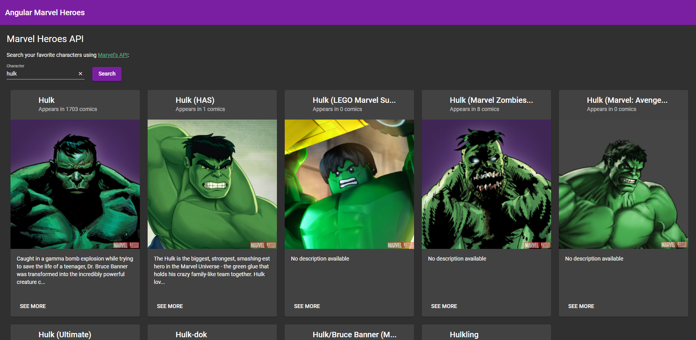
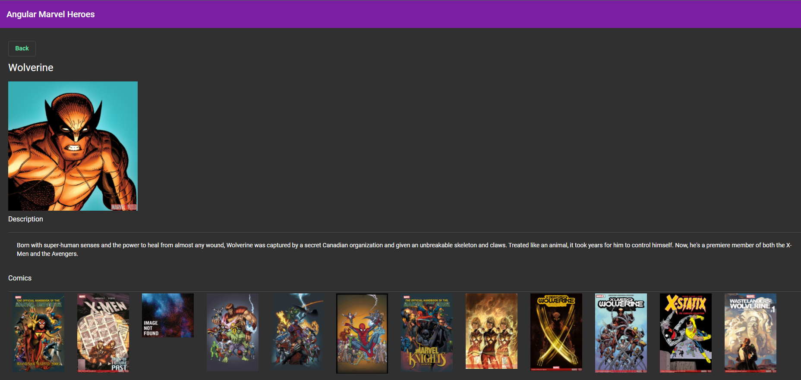

# Angular Marvel Heroes API

An Angular app that uses the <a href="https://developer.marvel.com/docs">Marvel's API</a> to search your favorite Hero

## Idea

Improving my angular skills with Angular Material and GitHub Actions

## Screenshots

<picture>

 
<label>Homepage</label>
</picture>
  

<picture>

 
<label>Hero Detail</label>
</picture>